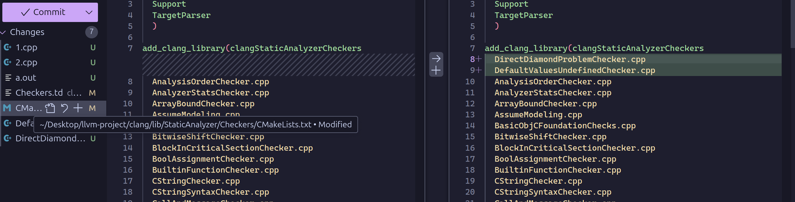
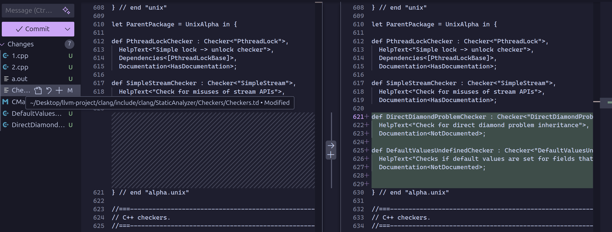

# custom-clang-analyzer-sugestions
This project project is an implementation of two custom static clang checkers.

## Setup

- Clone repos: 

`git clone --depth=1 --branch main git@github.com:llvm/llvm-project.git` 
  last commit tested on: 22b0835390516c2150c040521885c473f3a1e87e
  depth=1 options doesent copy the whole repo history but only the main branch
  
`git clone git@github.com:neske99/custom-clang-analyzer-sugestions.git`

Add the checkers from the optimization folder(from this project) in the clang/lib/StaticAnalyzer/Checkers folder of the clang project.

List the new optimizations in your CMakeLists.txt folder of the llvm project, path: clang/lib/StaticAnalyzer/Checkers.

List the new optimizations in your Checkers.td file of the llvm project path: clang/lib/StaticAnalyzer/Checkers. 

Then create a build folder from root and cd into of the project, cd into it and run:

 `cmake -DLLVM_ENABLE_PROJECTS=clang  -G "Unix Makefiles" ../llvm`
 
 `make` --optional use -j(num processors) this can reduce the time but can also fail because of wrong order of execution sometimes

Example run:

`./build/bin/scan-build -enable-checker alpha.unix.DefaultValuesUndefined clang++ filename.cpp`

